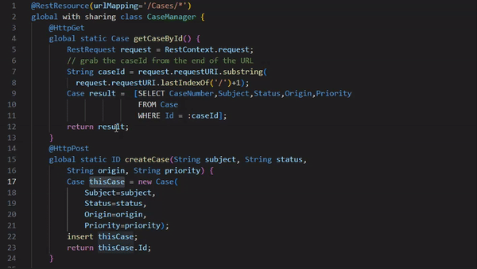

# Turbo System Debug 🚀

> Inspired by <a href="https://github.com/Chakroun-Anas/turbo-console-log">Turbo Console Log</a> 

# About Turbo System Debug

Turbo System Debug is a powerful tool designed to simplify and accelerate the process of creating Salesforce System.debug statements. It streamlines the debugging workflow by allowing users to quickly select a variable and generate corresponding debug statements with just a simple keyboard shortcut.

Example GIF
To illustrate the functionality of turbo-system-debug, check out the example GIF below:

Please note that this is just a sample GIF and doesn't represent the full range of debugging capabilities offered by turbo-system-debug. You can find more details about individual tools and their functionalities in the relevant sections of this repository.

Please note that this README is a work in progress, and more sections and details will be added soon.
